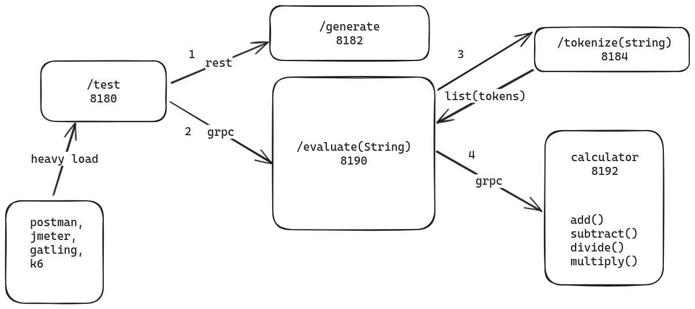

# Demo of high performance sync communication using gRPC and Virtual Threads

This project uses a simple domain, that of a Calculator, to demo the performance of sync blocking api calls using gRPC
and Virtual threads
We first look at the BODMAS rule for calculating arithmetic, which is accompanied by a simple java code that would take
care of it.

Then we create a Microservice Architechture to mimic many small but frequent sync communications, and then see how much
we can optimize it

## 1. BODMAS rule

The **BODMAS** rule is a mathematical convention that specifies the order of operations for solving expressions. It
stands for:

- **B**: Brackets (solve expressions within brackets first)
- **O**: Orders (handle exponents or roots, such as squares, square roots, etc.)
- **D**: Division (perform division next, from left to right)
- **M**: Multiplication (perform multiplication, from left to right)
- **A**: Addition (handle addition, from left to right)
- **S**: Subtraction (handle subtraction, from left to right)

The operations are prioritized in this order, with brackets taking the highest precedence and addition/subtraction the
lowest. When operations of the same priority (e.g., division and multiplication) appear, solve them **left to right**.

### Example

Evaluate:  
\[ 6 + 2 \times (3^2 - 1) \div 4 \]

1. Solve the brackets:  
   \[ 3^2 - 1 = 9 - 1 = 8 \]  
   The expression becomes:  
   \[ 6 + 2 \times 8 \div 4 \]

2. Handle orders: Already done in step 1.

3. Perform division and multiplication (left to right):  
   \[ 2 \times 8 = 16 \]  
   \[ 16 \div 4 = 4 \]  
   The expression becomes:  
   \[ 6 + 4 \]

4. Perform addition:  
   \[ 6 + 4 = 10 \]

**Answer**: 10

## 2. Core Java Monolithic Implementation

```java
import java.util._;
import java.util.regex._;
import java.util.stream.\*;

public class BODMASCalculator {

    public static void main(String[] args) {
        String expression = generateRandomExpression(10); // Generate random expression of size 10
        System.out.println("Generated Expression: " + expression);

        double result = evaluateExpression(expression);
        System.out.println("Result: " + result);
    }

    // Method 1: Generate a random expression
    public static String generateRandomExpression(int length) {
        Random random = new Random();
        String operators = "+-*/";
        StringBuilder expression = new StringBuilder();

        for (int i = 0; i < length; i++) {
            if (i % 2 == 0) { // Add a number
                expression.append(random.nextInt(9) + 1); // Random digit from 1 to 9
            } else { // Add an operator
                expression.append(operators.charAt(random.nextInt(operators.length())));
            }
        }
        return expression.toString();
    }

    // Method 2: Evaluate the expression
    public static double evaluateExpression(String expression) {
        List<Token> tokens = tokenizeExpression(expression);
        return evaluateTokens(tokens);
    }

    // Step 2.1: Tokenize the expression into numbers and operators
    private static List<Token> tokenizeExpression(String expression) {
        Pattern pattern = Pattern.compile("\\d+|[+\\-*/()]");
        Matcher matcher = pattern.matcher(expression);
        List<Token> tokens = new ArrayList<>();

        while (matcher.find()) {
            String match = matcher.group();
            if (match.matches("\\d+")) {
                tokens.add(new NumberToken(Double.parseDouble(match)));
            } else {
                tokens.add(new OperatorToken(match.charAt(0)));
            }
        }
        return tokens;
    }

    // Step 2.2: Evaluate the tokens using BODMAS
    private static double evaluateTokens(List<Token> tokens) {
        // Convert infix to postfix for easier evaluation
        List<Token> postfix = convertToPostfix(tokens);
        return evaluatePostfix(postfix);
    }

    // Step 2.2.1: Convert infix tokens to postfix (Shunting Yard Algorithm)
    private static List<Token> convertToPostfix(List<Token> tokens) {
        Deque<OperatorToken> operatorStack = new ArrayDeque<>();
        List<Token> postfix = new ArrayList<>();

        for (Token token : tokens) {
            if (token instanceof NumberToken numberToken) {
                postfix.add(numberToken);
            } else if (token instanceof OperatorToken operatorToken) {
                if (operatorToken.operator() == '(') {
                    operatorStack.push(operatorToken);
                } else if (operatorToken.operator() == ')') {
                    while (!operatorStack.isEmpty() && operatorStack.peek().operator() != '(') {
                        postfix.add(operatorStack.pop());
                    }
                    operatorStack.pop(); // Pop '('
                } else {
                    while (!operatorStack.isEmpty() && precedence(operatorStack.peek()) >= precedence(operatorToken)) {
                        postfix.add(operatorStack.pop());
                    }
                    operatorStack.push(operatorToken);
                }
            }
        }
        while (!operatorStack.isEmpty()) {
            postfix.add(operatorStack.pop());
        }
        return postfix;
    }

    // Step 2.2.2: Evaluate the postfix expression
    private static double evaluatePostfix(List<Token> postfix) {
        Deque<Double> stack = new ArrayDeque<>();
        for (Token token : postfix) {
            if (token instanceof NumberToken numberToken) {
                stack.push(numberToken.value());
            } else if (token instanceof OperatorToken operatorToken) {
                double b = stack.pop();
                double a = stack.pop();
                stack.push(applyOperator(a, b, operatorToken.operator()));
            }
        }
        return stack.pop();
    }

    // Helper: Apply operator to two numbers
    private static double applyOperator(double a, double b, char operator) {
        return switch (operator) {
            case '+' -> a + b;
            case '-' -> a - b;
            case '*' -> a * b;
            case '/' -> a / b;
            default -> throw new IllegalArgumentException("Unknown operator: " + operator);
        };
    }

    // Helper: Get operator precedence
    private static int precedence(OperatorToken operatorToken) {
        return switch (operatorToken.operator()) {
            case '+', '-' -> 1;
            case '*', '/' -> 2;
            default -> 0;
        };
    }

    // Sealed interface for Tokens
    sealed interface Token permits NumberToken, OperatorToken {
    }

    // Record for Number tokens
    record NumberToken(double value) implements Token {
    }

    // Record for Operator tokens
    record OperatorToken(char operator) implements Token {
    }

}
```

## 3. Desired Microservice Architechture:

**Flow Diagram**

Based on the below flow diagram, we will refine the monolithic codebase under `BODMASCalculator` above in a more
microservice based architechture:




---

1. **Generate Service**:

    - **REST Endpoint `/generate`**:
        - Generates and returns a **random infix expression** as a string (e.g., `3 + 5 * (2 - 1)`).
        - Accessible via Postman for manual testing.

2. **Evaluate Service**:

    - **gRPC Endpoint `/evaluate`**:
      This should also be Accessible over postman for manual testing
        - Accepts an infix expression as input.
        - Performs the following steps:
            1. Calls the **Tokenize Service** to convert the infix expression into a **list of POSTFIX tokens** (
               numbers, operators, brackets).
            2. Processes these tokens based on `evaluatePostfix` method from `BODMASCalculator` and calls **Calculator
               Service** over gRPC, to evaluate the final result, applying BODMAS rules.
        - Returns the calculated result.

3. **Tokenize Service**:

    - **REST based tokenization Endpoint `/tokenize`**:
        - Accepts an infix expression (e.g., `3 + 5 * (2 - 1)`).
        - Converts the infix expression into a **list of tokens** in the POSTFIX notation,
          like (`3`, `+`, `5`, `*`, `(`, `2`, `-`, `1`, `)`).
        - sends tokens back to the Evaluate Service.

4. **Calculator Service**:

    - **gRPC Endpoint with Basic Math Operations**:
        - Exposes operations like `add`, `subtract`, `multiply`, `divide`.
        - invoked as per logic in `evaluatePostfix` and `applyOperator` logic in `BODMASCalculator`

5. **Test Service**:
    - **REST Endpoint `/test`**:
        - Acts as the **integration service**:
            1. Calls the `/generate` REST endpoint to fetch a random infix expression.
            2. Sends this expression to the `/evaluate` gRPC endpoint.
            3. Returns the final result to the client.
        - Can be used to load test the complete system (`generate → tokenize → calculate`).

---

### **Revised Flow Recap**

1. **REST Endpoint** `/generate` produces the **infix expression**.
2. **REST Endpoint** `/tokenize` produces POSTFIX tokens list derived from the infix expression.
3. **gRPC Endpoint** `/evaluate` processes the token list, applies BODMAS, and calculates the result using the *
   *Calculator Service**.
4. **gRPC Endpoint** `add` `subtract` `multiply` `divide` actions exposed by **Calculator Service**
5. **REST Endpoint** `/test` integrates the flow for testing and benchmarking through load testing tools like jMeter or
   K6.

---

## **Polymorphic Serialization with Retrofit and Jackson**

This guide explains how to set up **Retrofit** with **Jackson** for handling polymorphic serialization and
deserialization of a sealed hierarchy in a **Java 21 Spring Boot** application. This setup is ideal for scenarios where
a `sealed interface` acts as a domain model, and its subtypes need to be serialized/deserialized seamlessly.

---

### **Overview: Key Features of Jackson for Polymorphism**

- Adds a `type` discriminator field to JSON during serialization.
- Automatically identifies subtypes during deserialization based on the `type` field.
- Supports Java 17+ features, including records.

---

### **1. Define the Sealed Hierarchy**

Use `@JsonTypeInfo` and `@JsonSubTypes` to guide Jackson for polymorphic (de)serialization.

```java
import com.fasterxml.jackson.annotation.JsonSubTypes;
import com.fasterxml.jackson.annotation.JsonTypeInfo;

// Sealed interface
@JsonTypeInfo(use = JsonTypeInfo.Id.NAME, include = JsonTypeInfo.As.PROPERTY, property = "type")
@JsonSubTypes({
        @JsonSubTypes.Type(value = Dog.class, name = "dog"),
        @JsonSubTypes.Type(value = Cat.class, name = "cat")
})
public sealed interface Animal permits Dog, Cat {
}

// Record types
public record Dog(String name, String breed) implements Animal {
}

public record Cat(String name, int livesLeft) implements Animal {
}
```

#### **Example JSON Payloads**

- For `Dog`:
  ```json
  {
    "type": "dog",  // automatically added by Jackson
    "name": "Rex",
    "breed": "Labrador"
  }
  ```

- For `Cat`:
  ```json
  {
    "type": "cat",
    "name": "Whiskers",
    "livesLeft": 9
  }
  ```

---

### **2. Configure Jackson in Spring Boot**

Ensure the application uses a properly configured `ObjectMapper`.

1. **Expose an `ObjectMapper` Bean**:
   ```java
   import com.fasterxml.jackson.databind.ObjectMapper;

   @Configuration
   public class AppConfig {
       @Bean
       public ObjectMapper objectMapper() {
           return new ObjectMapper()
               .findAndRegisterModules(); // Automatically supports records
       }
   }
   ```

---

### **3. Configure Retrofit with Jackson**

Set up Retrofit to use Jackson’s `ObjectMapper` for consistent (de)serialization.

1. **Add Retrofit Dependency**:
   Add the Retrofit and Jackson Converter dependencies to `pom.xml`:

   ```xml
   <dependency>
       <groupId>com.squareup.retrofit2</groupId>
       <artifactId>retrofit</artifactId>
       <version>${version}</version>
   </dependency>
   <dependency>
       <groupId>com.squareup.retrofit2</groupId>
       <artifactId>converter-jackson</artifactId>
       <version>${version}</version>
   </dependency>
   ```

2. **Configure Retrofit**:
   ```java
   import retrofit2.Retrofit;
   import retrofit2.converter.jackson.JacksonConverterFactory;

   @Configuration
   public class RetrofitConfig {
       @Bean
       public Retrofit retrofit(ObjectMapper objectMapper) {
           return new Retrofit.Builder()
               .baseUrl("https://api.example.com")
               .addConverterFactory(JacksonConverterFactory.create(objectMapper))
               .build();
       }
   }
   ```

---

## **4. Define Retrofit API**

Create an API interface to handle requests and responses using the `Animal` sealed hierarchy.

```java
import retrofit2.Call;
import retrofit2.http.Body;
import retrofit2.http.GET;
import retrofit2.http.POST;

import java.util.List;

public interface AnimalService {
    @POST("/animals")
    Call<Void> saveAnimal(@Body Animal animal);

    @GET("/animals")
    Call<List<Animal>> getAnimals();
}
```

---

## **5. Usage Examples**

### **Serialize and Send an Animal**

Example Controller to serialize and send a `Dog`:

```java

@RestController
public class AnimalController {
    private final AnimalService animalService;

    public AnimalController(Retrofit retrofit) {
        this.animalService = retrofit.create(AnimalService.class);
    }

    @PostMapping("/animals")
    public void addAnimal() throws IOException {
        Animal dog = new Dog("Rex", "Labrador");

        Response<Void> response = animalService.saveAnimal(dog).execute();
        if (!response.isSuccessful()) {
            throw new RuntimeException("Failed to save animal: " + response.errorBody().string());
        }
    }
}
```

### **Deserialize and Fetch Animals**

Example to deserialize a list of animals:

```java

@GetMapping("/animals")
public List<Animal> fetchAnimals() throws IOException {
    Response<List<Animal>> response = animalService.getAnimals().execute();
    if (response.isSuccessful()) {
        return response.body();
    } else {
        throw new RuntimeException("Failed to fetch animals: " + response.errorBody().string());
    }
}
```

---

## **6. Verify Polymorphic Serialization**

To test serialization logic manually:

```java
public static void main(String[] args) throws JsonProcessingException {
    ObjectMapper objectMapper = new ObjectMapper().findAndRegisterModules();

    Animal dog = new Dog("Rex", "Labrador");
    String json = objectMapper.writeValueAsString(dog);

    System.out.println(json); // {"type":"dog","name":"Rex","breed":"Labrador"}
}
```

---

## **Key Notes**

1. **Type Field**: The `type` field is added during serialization and determines the subtype during deserialization.
2. **Error Handling**: Ensure to handle errors for unknown or missing `type` fields during deserialization.
3. **Jackson Integration**: Using Jackson ensures consistency between Spring Boot and Retrofit serialization logic.

---

This setup allows the seamless use of `sealed` hierarchies as domain models with Retrofit and Jackson in a Spring Boot
application.

---

## **Exposing Prometheus Metrics for gRPC Servers**

### **Overview**

gRPC servers use HTTP/2 by default, but Prometheus requires an HTTP/1.x endpoint to scrape metrics. This document
outlines how to expose Prometheus metrics for a gRPC server by running a separate HTTP/1.x endpoint using Spring Boot
Actuator.

### **Problem**

When Prometheus attempts to scrape metrics from a gRPC server, the following error occurs:

```
io.grpc.netty.shaded.io.netty.handler.codec.http2.Http2Exception: Unexpected HTTP/1.x request: GET /actuator/prometheus
```

This happens because Prometheus sends HTTP/1.x requests, while the gRPC server only accepts HTTP/2 traffic. To resolve
this, we expose a dedicated HTTP/1.x endpoint for Prometheus metrics.

### **Solution**

#### **Expose a Separate HTTP/1.x Metrics Endpoint**

We run an HTTP server alongside the gRPC server specifically to expose Prometheus metrics.

#### **Steps**

##### **1. Add Dependencies**

Add the following dependencies to the `pom.xml` of your gRPC application:

```xml

<dependency>
    <groupId>org.springframework.boot</groupId>
    <artifactId>spring-boot-starter-actuator</artifactId>
</dependency>
<dependency>
<groupId>io.micrometer</groupId>
<artifactId>micrometer-registry-prometheus</artifactId>
</dependency>
```

These dependencies:

- Enable Spring Boot Actuator to expose system metrics.
- Configure Prometheus metrics collection.

#### **2. Enable HTTP 1.X Metrics in `application.properties`**

Configure the HTTP server to run on a different port (`8191`) from the gRPC server's port (`8190`).

```properties
grpc.server.port=8190
# .. other properties 
management.server.port=8191
```

#### **3. Start the Application**

When the application starts:

- The gRPC server continues to listen on its original port.
- The HTTP server listens on the configured port (`8081`) and serves Prometheus metrics
  at `http://localhost:8081/actuator/prometheus`.

#### **4. Update Prometheus Configuration**

Update the `prometheus.yml` file to scrape the new metrics endpoint:

```yaml
scrape_configs:
  - job_name: 'grpc-service'
    metrics_path: '/actuator/prometheus'
    static_configs:
      - targets: [ 'host.docker.internal:8081' ]  # HTTP metrics endpoint
```

Restart Prometheus to apply the changes.

### **Verification**

1. **Access Metrics Endpoint:**

   You should see a list of Prometheus metrics when you vist `http://localhost:8191/actuator/prometheus`
   Take any metrics from this page, example `grpc_server_call_sent_total_compressed_message_size_bytes_bucket` and check
   in prometheus UI

### **Benefits**

- **Seamless Integration**: Allows Prometheus to scrape gRPC server metrics without modifying core gRPC logic.
- **Scalability**: Each gRPC server instance can expose its metrics on a separate HTTP endpoint.
- **Flexibility**: By using Spring Boot Actuator, additional metrics (e.g., health checks) can also be exposed.

### **Conclusion**

By running a lightweight HTTP server alongside the gRPC server, we can easily expose Prometheus-compatible metrics
without disrupting the gRPC application. This approach ensures compatibility with Prometheus and allows for detailed
observability of gRPC services.

--- 